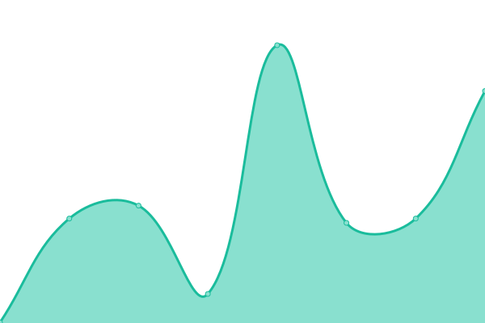
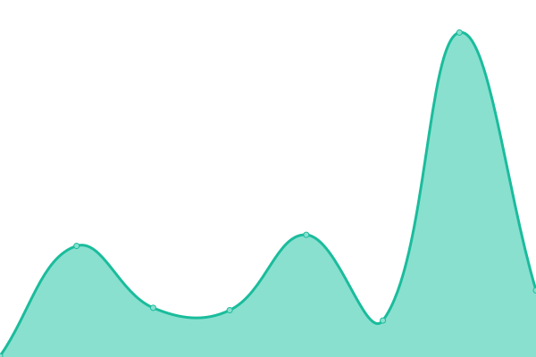
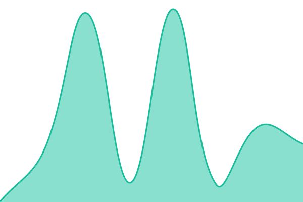
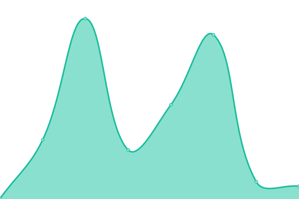
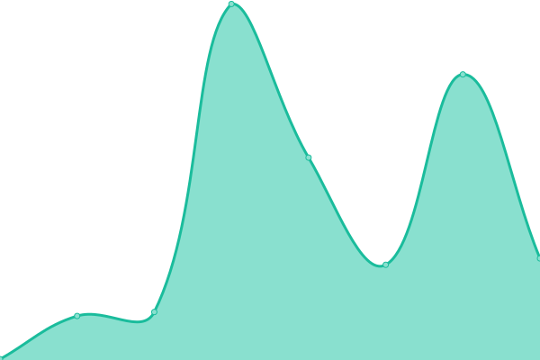
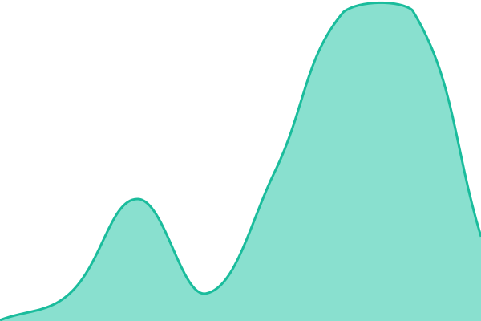
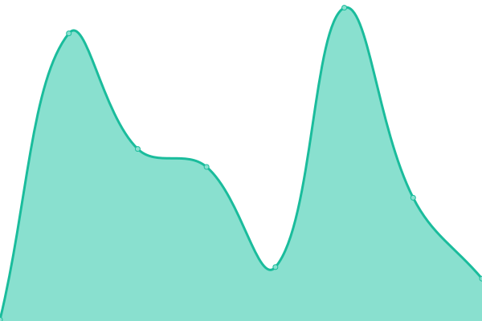

# [📈 Live Status](https://calindra.github.io/eitri-upptime): <!--live status--> **🟩 All systems operational**

This repository contains the open-source uptime monitor and status page for [Calindra](http://www.calindra.com.br), powered by [Upptime](https://github.com/upptime/upptime).

With [Upptime](https://upptime.js.org), you can get your own unlimited and free uptime monitor and status page, powered entirely by a GitHub repository. We use [Issues](https://github.com/calindra/eitri-upptime/issues) as incident reports, [Actions](https://github.com/calindra/eitri-upptime/actions) as uptime monitors, and [Pages](https://calindra.github.io/eitri-upptime) for the status page.

<!--start: status pages-->
<!-- This summary is generated by Upptime (https://github.com/upptime/upptime) -->
<!-- Do not edit this manually, your changes will be overwritten -->
<!-- prettier-ignore -->
| URL | Status | History | Response Time | Uptime |
| --- | ------ | ------- | ------------- | ------ |
|  [C&A Prod](https://api.eitri.tech/eitri-manager-api/o/environments/37c66d3b-f88c-44b1-b0a9-7b3adabf968e/configure) | 🟩 Up | [c-and-a-prod.yml](https://github.com/Calindra/eitri-upptime/commits/HEAD/history/c-and-a-prod.yml) | 

 162ms
     
 | 

<a href="https://calindra.github.io/eitri-upptime/history/c-and-a-prod">100.00%</a>
    

|  [C&A Dev](https://api.eitri.tech/eitri-manager-api/o/environments/09083bb9-3aeb-45dc-8581-5614cd120820/configure) | 🟩 Up | [c-and-a-dev.yml](https://github.com/Calindra/eitri-upptime/commits/HEAD/history/c-and-a-dev.yml) | 

 128ms
     
 | 

<a href="https://calindra.github.io/eitri-upptime/history/c-and-a-dev">100.00%</a>
    

|  [Calindra Prod](https://api.eitri.tech/eitri-manager-api/o/environments/956b5a02-6615-49b7-872b-a5c18d1a0748/configure) | 🟩 Up | [calindra-prod.yml](https://github.com/Calindra/eitri-upptime/commits/HEAD/history/calindra-prod.yml) | 

 113ms
     
 | 

<a href="https://calindra.github.io/eitri-upptime/history/calindra-prod">100.00%</a>
    

|  [Calindra Dev](https://api.eitri.tech/eitri-manager-api/o/environments/6430bc21-7068-4811-a627-b183afa6fd0a/configure) | 🟩 Up | [calindra-dev.yml](https://github.com/Calindra/eitri-upptime/commits/HEAD/history/calindra-dev.yml) | 

 112ms
     
 | 

<a href="https://calindra.github.io/eitri-upptime/history/calindra-dev">100.00%</a>
    

|  [Toymania Prod](https://api.eitri.tech/eitri-manager-api/o/environments/a3388e1f-d6ab-4ddc-a5a7-92c2b8e0fb36/configure) | 🟩 Up | [toymania-prod.yml](https://github.com/Calindra/eitri-upptime/commits/HEAD/history/toymania-prod.yml) | 

 110ms
     
 | 

<a href="https://calindra.github.io/eitri-upptime/history/toymania-prod">100.00%</a>
    

|  [Toymania Dev](https://api.eitri.tech/eitri-manager-api/o/environments/9804b891-8024-44d2-82d1-26d19e33d5b6/configure) | 🟩 Up | [toymania-dev.yml](https://github.com/Calindra/eitri-upptime/commits/HEAD/history/toymania-dev.yml) | 

 111ms
     
 | 

<a href="https://calindra.github.io/eitri-upptime/history/toymania-dev">100.00%</a>
    

|  [Scolados Prod](https://api.eitri.tech/eitri-manager-api/o/environments/0cd805d6-e728-4a51-a356-b2d716cf364e/configure) | 🟩 Up | [scolados-prod.yml](https://github.com/Calindra/eitri-upptime/commits/HEAD/history/scolados-prod.yml) | 

 113ms
     
 | 

<a href="https://calindra.github.io/eitri-upptime/history/scolados-prod">100.00%</a>
    

|  [Scolados Dev](https://api.eitri.tech/eitri-manager-api/o/environments/292d923b-3fde-4978-97d0-912ae3209fe2/configure) | 🟩 Up | [scolados-dev.yml](https://github.com/Calindra/eitri-upptime/commits/HEAD/history/scolados-dev.yml) | 

 114ms
     
 | 

<a href="https://calindra.github.io/eitri-upptime/history/scolados-dev">100.00%</a>
    

|  [Foundry](https://api.eitri.tech/foundry/health) | 🟩 Up | [foundry.yml](https://github.com/Calindra/eitri-upptime/commits/HEAD/history/foundry.yml) | 

 162ms
     
 | 

<a href="https://calindra.github.io/eitri-upptime/history/foundry">100.00%</a>
    

|  [Runes Foundry](https://api.eitri.tech/runes-foundry/health) | 🟩 Up | [runes-foundry.yml](https://github.com/Calindra/eitri-upptime/commits/HEAD/history/runes-foundry.yml) | 

 98ms
     
 | 

<a href="https://calindra.github.io/eitri-upptime/history/runes-foundry">100.00%</a>
    

|  [Blind Guardian](https://api.eitri.tech/blind-guardian-api/health) | 🟩 Up | [blind-guardian.yml](https://github.com/Calindra/eitri-upptime/commits/HEAD/history/blind-guardian.yml) | 

 48ms
     
 | 

<a href="https://calindra.github.io/eitri-upptime/history/blind-guardian">100.00%</a>
    

|  [Eitri Manager API](https://api.eitri.tech/eitri-manager-api/health) | 🟩 Up | [eitri-manager-api.yml](https://github.com/Calindra/eitri-upptime/commits/HEAD/history/eitri-manager-api.yml) | 

 78ms
     
 | 

<a href="https://calindra.github.io/eitri-upptime/history/eitri-manager-api">100.00%</a>
    

|  [Mini Log](https://api.eitri.tech/mini-log/health) | 🟩 Up | [mini-log.yml](https://github.com/Calindra/eitri-upptime/commits/HEAD/history/mini-log.yml) | 

 50ms
     
 | 

<a href="https://calindra.github.io/eitri-upptime/history/mini-log">100.00%</a>
    

|  [Vegvisir](https://api.eitri.tech/eitri-vegvisir-api/health) | 🟩 Up | [vegvisir.yml](https://github.com/Calindra/eitri-upptime/commits/HEAD/history/vegvisir.yml) | 

 51ms
     
 | 

<a href="https://calindra.github.io/eitri-upptime/history/vegvisir">100.00%</a>
    

|  [Share API](https://api.eitri.tech/share-api/health) | 🟩 Up | [share-api.yml](https://github.com/Calindra/eitri-upptime/commits/HEAD/history/share-api.yml) | 

 43ms
     
 | 

<a href="https://calindra.github.io/eitri-upptime/history/share-api">100.00%</a>
    

|  [Push Notification](https://api.eitri.tech/push-notification-eitri-shop-api/health) | 🟩 Up | [push-notification.yml](https://github.com/Calindra/eitri-upptime/commits/HEAD/history/push-notification.yml) | 

 49ms
     
 | 

<a href="https://calindra.github.io/eitri-upptime/history/push-notification">100.00%</a>
    

|  [Valkyrie API](https://api.eitri.tech/eitri-valkyrie-api/health) | 🟩 Up | [valkyrie-api.yml](https://github.com/Calindra/eitri-upptime/commits/HEAD/history/valkyrie-api.yml) | 

 50ms
     
 | 

<a href="https://calindra.github.io/eitri-upptime/history/valkyrie-api">100.00%</a>
    

|  [Analytics](https://api.eitri.tech/analytics/health) | 🟩 Up | [analytics.yml](https://github.com/Calindra/eitri-upptime/commits/HEAD/history/analytics.yml) | 

 47ms
     
 | 

<a href="https://calindra.github.io/eitri-upptime/history/analytics">100.00%</a>
    

|  [Eitri-Doctor (v2.6.2) Release](https://release.eitri.calindra.com.br/build/organizations/cf5660ee-bf90-42cd-9a43-9d2c69ee3c89/applications/749d6f6f-f10f-4448-b36e-9c484b1293b8/eitri-apps/eitri-doctor/2.6.2/environment/57765091-4dc1-4341-a24b-6a5658a9fe52/index.html) | 🟩 Up | [eitri-doctor-v2-6-2-release.yml](https://github.com/Calindra/eitri-upptime/commits/HEAD/history/eitri-doctor-v2-6-2-release.yml) | 

 295ms
     
 | 

<a href="https://calindra.github.io/eitri-upptime/history/eitri-doctor-v2-6-2-release">100.00%</a>
    

<!--end: status pages-->

[**Visit our status website →**](https://calindra.github.io/eitri-upptime)

## 📄 License

- Powered by: [Upptime](https://github.com/upptime/upptime)
- Code: [MIT](./LICENSE) © [Anand Chowdhary](https://anandchowdhary.com), supported by [Pabio](https://pabio.com)
- Data in the `./history` directory: [Open Database License](https://opendatacommons.org/licenses/odbl/1-0/)
