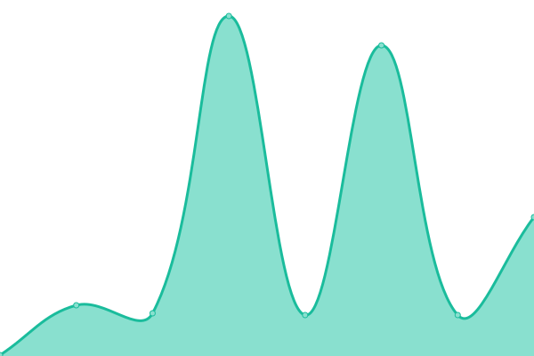
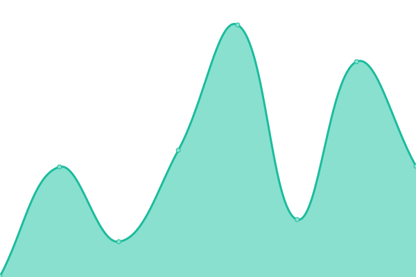
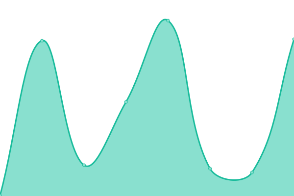
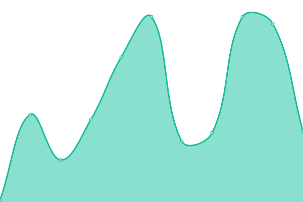
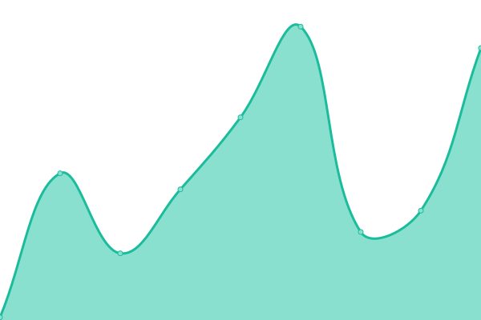
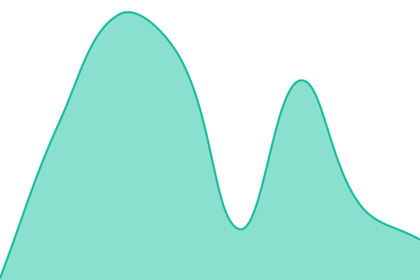

# [📈 Live Status](https://calindra.github.io/eitri-upptime): <!--live status--> **🟩 All systems operational**

This repository contains the open-source uptime monitor and status page for [Calindra](http://www.calindra.com.br), powered by [Upptime](https://github.com/upptime/upptime).

With [Upptime](https://upptime.js.org), you can get your own unlimited and free uptime monitor and status page, powered entirely by a GitHub repository. We use [Issues](https://github.com/calindra/eitri-upptime/issues) as incident reports, [Actions](https://github.com/calindra/eitri-upptime/actions) as uptime monitors, and [Pages](https://calindra.github.io/eitri-upptime) for the status page.

<!--start: status pages-->
<!-- This summary is generated by Upptime (https://github.com/upptime/upptime) -->
<!-- Do not edit this manually, your changes will be overwritten -->
<!-- prettier-ignore -->
| URL | Status | History | Response Time | Uptime |
| --- | ------ | ------- | ------------- | ------ |
|  [C&A Prod](https://api.eitri.tech/eitri-manager-api/o/environments/37c66d3b-f88c-44b1-b0a9-7b3adabf968e/configure) | 🟩 Up | [c-and-a-prod.yml](https://github.com/Calindra/eitri-upptime/commits/HEAD/history/c-and-a-prod.yml) | 

 305ms
     
 | 

<a href="https://calindra.github.io/eitri-upptime/history/c-and-a-prod">93.42%</a>
    

|  [C&A Dev](https://api.eitri.tech/eitri-manager-api/o/environments/09083bb9-3aeb-45dc-8581-5614cd120820/configure) | 🟩 Up | [c-and-a-dev.yml](https://github.com/Calindra/eitri-upptime/commits/HEAD/history/c-and-a-dev.yml) | 

 179ms
     
 | 

<a href="https://calindra.github.io/eitri-upptime/history/c-and-a-dev">93.43%</a>
    

|  [Calindra Prod](https://api.eitri.tech/eitri-manager-api/o/environments/956b5a02-6615-49b7-872b-a5c18d1a0748/configure) | 🟩 Up | [calindra-prod.yml](https://github.com/Calindra/eitri-upptime/commits/HEAD/history/calindra-prod.yml) | 

 184ms
     
 | 

<a href="https://calindra.github.io/eitri-upptime/history/calindra-prod">93.45%</a>
    

|  [Calindra Dev](https://api.eitri.tech/eitri-manager-api/o/environments/6430bc21-7068-4811-a627-b183afa6fd0a/configure) | 🟩 Up | [calindra-dev.yml](https://github.com/Calindra/eitri-upptime/commits/HEAD/history/calindra-dev.yml) | 

 171ms
     
 | 

<a href="https://calindra.github.io/eitri-upptime/history/calindra-dev">93.46%</a>
    

|  [Toymania Prod](https://api.eitri.tech/eitri-manager-api/o/environments/a3388e1f-d6ab-4ddc-a5a7-92c2b8e0fb36/configure) | 🟩 Up | [toymania-prod.yml](https://github.com/Calindra/eitri-upptime/commits/HEAD/history/toymania-prod.yml) | 

 139ms
     
 | 

<a href="https://calindra.github.io/eitri-upptime/history/toymania-prod">93.48%</a>
    

|  [Toymania Dev](https://api.eitri.tech/eitri-manager-api/o/environments/9804b891-8024-44d2-82d1-26d19e33d5b6/configure) | 🟩 Up | [toymania-dev.yml](https://github.com/Calindra/eitri-upptime/commits/HEAD/history/toymania-dev.yml) | 

 139ms
     
 | 

<a href="https://calindra.github.io/eitri-upptime/history/toymania-dev">93.49%</a>
    

|  [Scolados Prod](https://api.eitri.tech/eitri-manager-api/o/environments/0cd805d6-e728-4a51-a356-b2d716cf364e/configure) | 🟩 Up | [scolados-prod.yml](https://github.com/Calindra/eitri-upptime/commits/HEAD/history/scolados-prod.yml) | 

 174ms
     
 | 

<a href="https://calindra.github.io/eitri-upptime/history/scolados-prod">93.55%</a>
    

|  [Scolados Dev](https://api.eitri.tech/eitri-manager-api/o/environments/292d923b-3fde-4978-97d0-912ae3209fe2/configure) | 🟩 Up | [scolados-dev.yml](https://github.com/Calindra/eitri-upptime/commits/HEAD/history/scolados-dev.yml) | 

 107ms
     
 | 

<a href="https://calindra.github.io/eitri-upptime/history/scolados-dev">93.56%</a>
    

|  [Canal Dev](https://api.eitri.tech/eitri-manager-api/o/environments/f7cfafbf-2088-46ef-b6d9-12d562c0d5fd/configure) | 🟩 Up | [canal-dev.yml](https://github.com/Calindra/eitri-upptime/commits/HEAD/history/canal-dev.yml) | 

 136ms
     
 | 

<a href="https://calindra.github.io/eitri-upptime/history/canal-dev">93.56%</a>
    

|  [Canal Prod](https://api.eitri.tech/eitri-manager-api/o/environments/cc6d2570-7ec8-4577-8da2-fa9f2dab8ad1/configure) | 🟩 Up | [canal-prod.yml](https://github.com/Calindra/eitri-upptime/commits/HEAD/history/canal-prod.yml) | 

 123ms
     
 | 

<a href="https://calindra.github.io/eitri-upptime/history/canal-prod">93.58%</a>
    

|  [Americanas](https://api.eitri.tech/eitri-manager-api/o/environments/8115d9c7-108b-48d3-8b5a-e69fb6d9fc9d/configure) | 🟩 Up | [americanas.yml](https://github.com/Calindra/eitri-upptime/commits/HEAD/history/americanas.yml) | 

 67ms
     
 | 

<a href="https://calindra.github.io/eitri-upptime/history/americanas">16.74%</a>
    

|  [BlackSkull](https://api.eitri.tech/eitri-manager-api/o/environments/dba1f66d-7e72-4ee3-8f3b-4caecdbb676c/configure) | 🟩 Up | [black-skull.yml](https://github.com/Calindra/eitri-upptime/commits/HEAD/history/black-skull.yml) | 

 66ms
     
 | 

<a href="https://calindra.github.io/eitri-upptime/history/black-skull">16.99%</a>
    

|  [EitriPlay](https://api.eitri.tech/eitri-manager-api/o/environments/c1b01b5b-397a-428e-8884-27adfa9a0ef6/configure) | 🟩 Up | [eitri-play.yml](https://github.com/Calindra/eitri-upptime/commits/HEAD/history/eitri-play.yml) | 

 62ms
     
 | 

<a href="https://calindra.github.io/eitri-upptime/history/eitri-play">17.24%</a>
    

|  [Ladeira](https://api.eitri.tech/eitri-manager-api/o/environments/80722bba-8aaf-4782-b1ae-3690fdddfa91/configure) | 🟩 Up | [ladeira.yml](https://github.com/Calindra/eitri-upptime/commits/HEAD/history/ladeira.yml) | 

 64ms
     
 | 

<a href="https://calindra.github.io/eitri-upptime/history/ladeira">98.22%</a>
    

|  [LojasTorra](https://api.eitri.tech/eitri-manager-api/o/environments/39b09fe1-7713-4b73-b551-681b7525f3a3/configure) | 🟩 Up | [lojas-torra.yml](https://github.com/Calindra/eitri-upptime/commits/HEAD/history/lojas-torra.yml) | 

 64ms
     
 | 

<a href="https://calindra.github.io/eitri-upptime/history/lojas-torra">98.22%</a>
    

|  [MundoVerde](https://api.eitri.tech/eitri-manager-api/o/environments/c6bdfbb7-72c3-481b-bd5d-968ce4a3ebee/configure) | 🟩 Up | [mundo-verde.yml](https://github.com/Calindra/eitri-upptime/commits/HEAD/history/mundo-verde.yml) | 

 74ms
     
 | 

<a href="https://calindra.github.io/eitri-upptime/history/mundo-verde">98.22%</a>
    

|  [Polishop](https://api.eitri.tech/eitri-manager-api/o/environments/448fc7a8-0c33-48ae-981a-c5e3183daf51/configure) | 🟩 Up | [polishop.yml](https://github.com/Calindra/eitri-upptime/commits/HEAD/history/polishop.yml) | 

 68ms
     
 | 

<a href="https://calindra.github.io/eitri-upptime/history/polishop">98.22%</a>
    

|  [Shoulder](https://api.eitri.tech/eitri-manager-api/o/environments/e673ba1c-ac50-4bd7-bed5-41c75782042e/configure) | 🟩 Up | [shoulder.yml](https://github.com/Calindra/eitri-upptime/commits/HEAD/history/shoulder.yml) | 

 64ms
     
 | 

<a href="https://calindra.github.io/eitri-upptime/history/shoulder">98.23%</a>
    

|  [DrogariaVenancio](https://api.eitri.tech/eitri-manager-api/o/environments/90daab12-b354-4261-b724-9620aacf8bd2/configure) | 🟩 Up | [drogaria-venancio.yml](https://github.com/Calindra/eitri-upptime/commits/HEAD/history/drogaria-venancio.yml) | 

 65ms
     
 | 

<a href="https://calindra.github.io/eitri-upptime/history/drogaria-venancio">98.23%</a>
    

|  [Seedtime](https://api.eitri.tech/eitri-manager-api/o/environments/6a84551e-e2da-4970-8022-27ee0b5a38d9/configure) | 🟩 Up | [seedtime.yml](https://github.com/Calindra/eitri-upptime/commits/HEAD/history/seedtime.yml) | 

 63ms
     
 | 

<a href="https://calindra.github.io/eitri-upptime/history/seedtime">98.23%</a>
    

|  [Foundry](https://api.eitri.tech/foundry/health) | 🟩 Up | [foundry.yml](https://github.com/Calindra/eitri-upptime/commits/HEAD/history/foundry.yml) | 

 192ms
     
 | 

<a href="https://calindra.github.io/eitri-upptime/history/foundry">98.77%</a>
    

|  [Runes Foundry](https://api.eitri.tech/runes-foundry/health) | 🟩 Up | [runes-foundry.yml](https://github.com/Calindra/eitri-upptime/commits/HEAD/history/runes-foundry.yml) | 

 81ms
     
 | 

<a href="https://calindra.github.io/eitri-upptime/history/runes-foundry">98.74%</a>
    

|  [Blind Guardian](https://api.eitri.tech/blind-guardian-api/health) | 🟩 Up | [blind-guardian.yml](https://github.com/Calindra/eitri-upptime/commits/HEAD/history/blind-guardian.yml) | 

 58ms
     
 | 

<a href="https://calindra.github.io/eitri-upptime/history/blind-guardian">98.74%</a>
    

|  [Eitri Manager API](https://api.eitri.tech/eitri-manager-api/health) | 🟩 Up | [eitri-manager-api.yml](https://github.com/Calindra/eitri-upptime/commits/HEAD/history/eitri-manager-api.yml) | 

 59ms
     
 | 

<a href="https://calindra.github.io/eitri-upptime/history/eitri-manager-api">98.74%</a>
    

|  [Mini Log](https://api.eitri.tech/mini-log/health) | 🟩 Up | [mini-log.yml](https://github.com/Calindra/eitri-upptime/commits/HEAD/history/mini-log.yml) | 

 58ms
     
 | 

<a href="https://calindra.github.io/eitri-upptime/history/mini-log">98.74%</a>
    

|  [Vegvisir](https://api.eitri.tech/eitri-vegvisir-api/health) | 🟩 Up | [vegvisir.yml](https://github.com/Calindra/eitri-upptime/commits/HEAD/history/vegvisir.yml) | 

 59ms
     
 | 

<a href="https://calindra.github.io/eitri-upptime/history/vegvisir">98.74%</a>
    

|  [Share API](https://api.eitri.tech/share-api/health) | 🟩 Up | [share-api.yml](https://github.com/Calindra/eitri-upptime/commits/HEAD/history/share-api.yml) | 

 57ms
     
 | 

<a href="https://calindra.github.io/eitri-upptime/history/share-api">98.74%</a>
    

|  [Push Notification](https://api.eitri.tech/push-notification-eitri-shop-api/health) | 🟩 Up | [push-notification.yml](https://github.com/Calindra/eitri-upptime/commits/HEAD/history/push-notification.yml) | 

 58ms
     
 | 

<a href="https://calindra.github.io/eitri-upptime/history/push-notification">98.74%</a>
    

|  [Valkyrie API](https://api.eitri.tech/eitri-valkyrie-api/health) | 🟩 Up | [valkyrie-api.yml](https://github.com/Calindra/eitri-upptime/commits/HEAD/history/valkyrie-api.yml) | 

 58ms
     
 | 

<a href="https://calindra.github.io/eitri-upptime/history/valkyrie-api">98.74%</a>
    

|  [Analytics](https://api.eitri.tech/analytics/health) | 🟩 Up | [analytics.yml](https://github.com/Calindra/eitri-upptime/commits/HEAD/history/analytics.yml) | 

 57ms
     
 | 

<a href="https://calindra.github.io/eitri-upptime/history/analytics">98.74%</a>
    

|  [Eitri-Doctor (v2.6.2) Release](https://release.eitri.calindra.com.br/build/organizations/cf5660ee-bf90-42cd-9a43-9d2c69ee3c89/applications/749d6f6f-f10f-4448-b36e-9c484b1293b8/eitri-apps/eitri-doctor/2.6.2/environment/57765091-4dc1-4341-a24b-6a5658a9fe52/index.html) | 🟩 Up | [eitri-doctor-v2-6-2-release.yml](https://github.com/Calindra/eitri-upptime/commits/HEAD/history/eitri-doctor-v2-6-2-release.yml) | 

 350ms
     
 | 

<a href="https://calindra.github.io/eitri-upptime/history/eitri-doctor-v2-6-2-release">100.00%</a>
    

|  [Mailer API](https://api.eitri.tech/eitri-mailer-api/health) | 🟩 Up | [mailer-api.yml](https://github.com/Calindra/eitri-upptime/commits/HEAD/history/mailer-api.yml) | 

 57ms
     
 | 

<a href="https://calindra.github.io/eitri-upptime/history/mailer-api">98.74%</a>
    

|  [Eitri Hugin](https://api.eitri.tech/eitri-hugin-api/health) | 🟩 Up | [eitri-hugin.yml](https://github.com/Calindra/eitri-upptime/commits/HEAD/history/eitri-hugin.yml) | 

 57ms
     
 | 

<a href="https://calindra.github.io/eitri-upptime/history/eitri-hugin">98.74%</a>
    

<!--end: status pages-->

[**Visit our status website →**](https://calindra.github.io/eitri-upptime)

## 📄 License

- Powered by: [Upptime](https://github.com/upptime/upptime)
- Code: [MIT](./LICENSE) © [Anand Chowdhary](https://anandchowdhary.com), supported by [Pabio](https://pabio.com)
- Data in the `./history` directory: [Open Database License](https://opendatacommons.org/licenses/odbl/1-0/)
