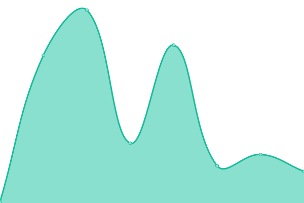
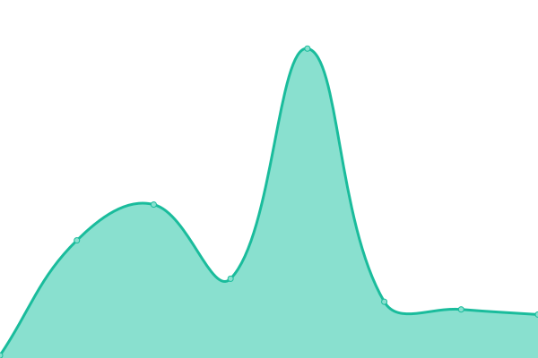
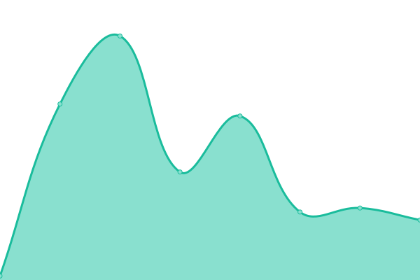
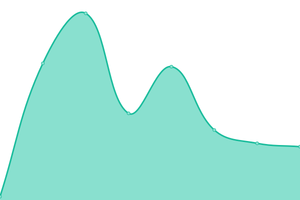
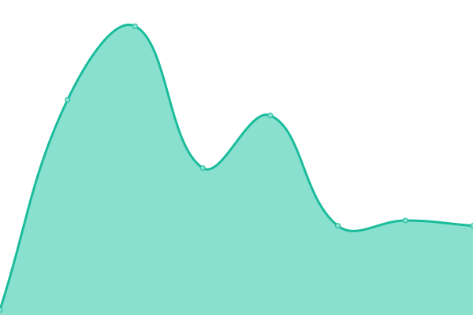
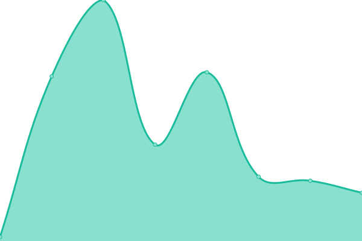
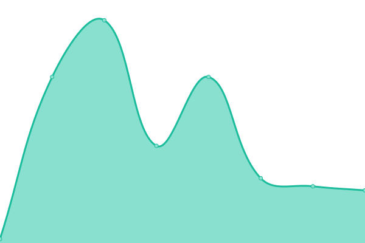

# Eitri Upptime

Monitoramento de uptime e status page dos serviços Eitri, powered by [Upptime](https://github.com/upptime/upptime).

## Status dos Serviços

<!--start: status pages-->
<!-- This summary is generated by Upptime (https://github.com/upptime/upptime) -->
<!-- Do not edit this manually, your changes will be overwritten -->
<!-- prettier-ignore -->
| URL | Status | History | Response Time | Uptime |
| --- | ------ | ------- | ------------- | ------ |
|  [Eitri Play](https://api.eitri.tech/eitri-manager-api/o/environments/c1b01b5b-397a-428e-8884-27adfa9a0ef6/configure) | 🟩 Up | [eitri-play.yml](https://github.com/Calindra/eitri-upptime/commits/HEAD/history/eitri-play.yml) | 

 210ms
     
 | 

<a href="https://calindra.github.io/eitri-upptime/history/eitri-play">100.00%</a>
    

|  [Foundry](https://api.eitri.tech/foundry/health) | 🟩 Up | [foundry.yml](https://github.com/Calindra/eitri-upptime/commits/HEAD/history/foundry.yml) | 

 142ms
     
 | 

<a href="https://calindra.github.io/eitri-upptime/history/foundry">100.00%</a>
    

|  [Runes Foundry](https://api.eitri.tech/runes-foundry/health) | 🟩 Up | [runes-foundry.yml](https://github.com/Calindra/eitri-upptime/commits/HEAD/history/runes-foundry.yml) | 

 72ms
     
 | 

<a href="https://calindra.github.io/eitri-upptime/history/runes-foundry">100.00%</a>
    

|  [Blind Guardian](https://api.eitri.tech/blind-guardian-api/health) | 🟩 Up | [blind-guardian.yml](https://github.com/Calindra/eitri-upptime/commits/HEAD/history/blind-guardian.yml) | 

 70ms
     
 | 

<a href="https://calindra.github.io/eitri-upptime/history/blind-guardian">100.00%</a>
    

|  [Eitri Manager API](https://api.eitri.tech/eitri-manager-api/health) | 🟩 Up | [eitri-manager-api.yml](https://github.com/Calindra/eitri-upptime/commits/HEAD/history/eitri-manager-api.yml) | 

 65ms
     
 | 

<a href="https://calindra.github.io/eitri-upptime/history/eitri-manager-api">100.00%</a>
    

|  [Mini Log](https://api.eitri.tech/mini-log/health) | 🟩 Up | [mini-log.yml](https://github.com/Calindra/eitri-upptime/commits/HEAD/history/mini-log.yml) | 

 67ms
     
 | 

<a href="https://calindra.github.io/eitri-upptime/history/mini-log">100.00%</a>
    

|  [Vegvisir](https://api.eitri.tech/eitri-vegvisir-api/health) | 🟩 Up | [vegvisir.yml](https://github.com/Calindra/eitri-upptime/commits/HEAD/history/vegvisir.yml) | 

 68ms
     
 | 

<a href="https://calindra.github.io/eitri-upptime/history/vegvisir">100.00%</a>
    

|  [Share API](https://api.eitri.tech/share-api/health) | 🟩 Up | [share-api.yml](https://github.com/Calindra/eitri-upptime/commits/HEAD/history/share-api.yml) | 

 69ms
     
 | 

<a href="https://calindra.github.io/eitri-upptime/history/share-api">100.00%</a>
    

|  [Push Notification](https://api.eitri.tech/push-notification-eitri-shop-api/health) | 🟩 Up | [push-notification.yml](https://github.com/Calindra/eitri-upptime/commits/HEAD/history/push-notification.yml) | 

 68ms
     
 | 

<a href="https://calindra.github.io/eitri-upptime/history/push-notification">100.00%</a>
    

|  [Valkyrie API](https://api.eitri.tech/eitri-valkyrie-api/health) | 🟩 Up | [valkyrie-api.yml](https://github.com/Calindra/eitri-upptime/commits/HEAD/history/valkyrie-api.yml) | 

 64ms
     
 | 

<a href="https://calindra.github.io/eitri-upptime/history/valkyrie-api">100.00%</a>
    

|  [Analytics](https://api.eitri.tech/analytics/health) | 🟩 Up | [analytics.yml](https://github.com/Calindra/eitri-upptime/commits/HEAD/history/analytics.yml) | 

 65ms
     
 | 

<a href="https://calindra.github.io/eitri-upptime/history/analytics">100.00%</a>
    

|  [Mailer API](https://api.eitri.tech/eitri-mailer-api/health) | 🟩 Up | [mailer-api.yml](https://github.com/Calindra/eitri-upptime/commits/HEAD/history/mailer-api.yml) | 

 65ms
     
 | 

<a href="https://calindra.github.io/eitri-upptime/history/mailer-api">100.00%</a>
    

|  [Eitri Hugin](https://api.eitri.tech/eitri-hugin-api/health) | 🟩 Up | [eitri-hugin.yml](https://github.com/Calindra/eitri-upptime/commits/HEAD/history/eitri-hugin.yml) | 

 64ms
     
 | 

<a href="https://calindra.github.io/eitri-upptime/history/eitri-hugin">100.00%</a>
    

|  [Eitri Content (ECS)](https://beta-content.eitri.tech/admin) | 🟩 Up | [eitri-content-ecs.yml](https://github.com/Calindra/eitri-upptime/commits/HEAD/history/eitri-content-ecs.yml) | 

 282ms
     
 | 

<a href="https://calindra.github.io/eitri-upptime/history/eitri-content-ecs">100.00%</a>
    

|  [Eitri Content (K8s)](https://api.eitri.tech/eitri-content/health) | 🟩 Up | [eitri-content-k8s.yml](https://github.com/Calindra/eitri-upptime/commits/HEAD/history/eitri-content-k8s.yml) | 

 66ms
     
 | 

<a href="https://calindra.github.io/eitri-upptime/history/eitri-content-k8s">100.00%</a>
    

<!--end: status pages-->

[**Visite nossa status page →**](https://calindra.github.io/eitri-upptime)

## O que é Upptime?

Upptime é um monitor de uptime open-source e status page, totalmente powered by GitHub Actions, Issues e Pages.

- **GitHub Actions** para monitoramento a cada 5 minutos
- **GitHub Issues** para relatórios de incidentes
- **GitHub Pages** para a status page
